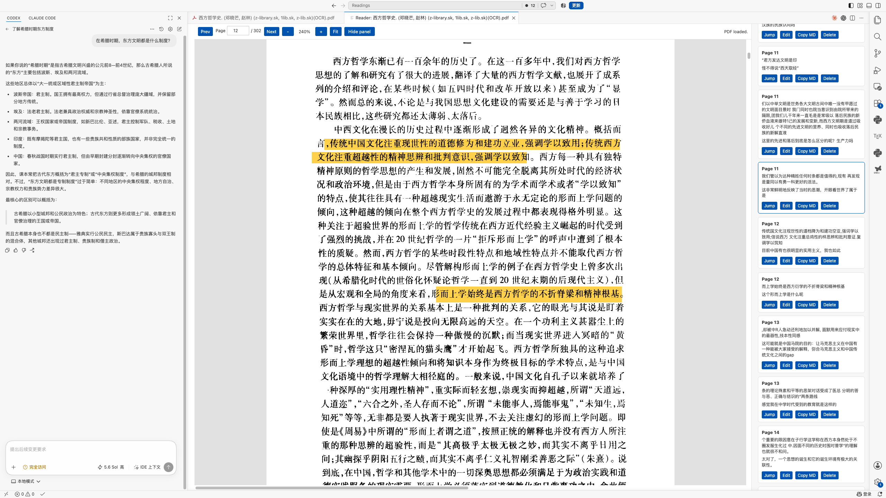

<div align="center">
  
  <h1>Inleaf Reader</h1>
  <p><strong>Your Books. Your AI. Your Flow.</strong></p>
  <p>在 VS Code 里阅读 PDF，用你自己的 AI 随时提问，让思考不断流。</p>
</div>



## What is Inleaf Reader?

Inleaf Reader turns VS Code into a focused reading space for papers and books.
It keeps frequent actions close to the page and lets you use the AI tools you
already trust beside your document. You can ask for background, investigate a
question, annotate a passage, translate text, or save a word without repeatedly
leaving the reading context.

Your reading data stays in ordinary files next to the PDF. This means it remains
under your control, can be backed up or synchronized with the tools you already
use, and is straightforward for AI tools to inspect and work with.

### At a glance

- **Read comfortably:** continuous scrolling, page progress, fit controls, and trackpad zoom.
- **Bring your own AI:** work beside Codex, Claude Code, or another assistant instead of being locked into a paid reader-specific AI.
- **Annotate in place:** highlight, underline, add notes and tags, then edit them beside the original text.
- **Translate as you read:** use the bundled offline dictionary, local Argos Translate, DeepSeek, or LibreTranslate.
- **Build a wordbook:** save useful English words and their structured definitions for each PDF.
- **Keep data AI-ready:** annotations, vocabulary, exports, and progress use portable files beside the document.
- **Ask Codex in context:** send a located passage, nearby evidence, confirmed metadata, and repository snapshots to a read-only Codex CLI session.
- **Build a research library:** keep per-paper profiles, filter a local corpus, compare located evidence, and return to the source page.
- **Stay focused:** the side panel starts hidden and appears only when you ask for it.

## Who is it for?

Inleaf Reader is especially useful if you:

- read papers or technical books while working in VS Code;
- want annotations and progress to stay with the original PDF;
- use coding assistants such as Codex or Claude Code beside your reading window;
- prefer offline or user-controlled tools over a mandatory cloud account.

## Install

### From a VSIX

Download the VSIX from the
[latest GitHub release](https://github.com/WORMMMMMM/inleaf-reader/releases/latest),
then choose **Extensions: Install from VSIX...** in VS Code.

You can also install it from a terminal:

```bash
code --install-extension inleaf-reader-0.0.11.vsix
```

After installation, run **Developer: Reload Window** once if the reader command
does not appear immediately.

When developing from a local checkout, `./install` packages and installs that
checkout into ordinary VS Code in one step. Reload open VS Code windows once;
afterward, opening any PDF exposes the Inleaf book icon without a development
server or Extension Development Host.

> **Moving from an earlier pre-Inleaf build?** VS Code treats the current
> `ziming.inleaf-reader` identity as a separate extension. Install Inleaf Reader,
> remove the earlier extension, and reopen each PDF once. Existing local
> sidecars beside that PDF are copied into `.inleaf-reader/` without overwriting
> current files. Provider settings and API keys should be configured again.

### From the VS Code Marketplace

When the public Marketplace release is available, search for **Inleaf Reader**
in the Extensions view and select **Install**.

## Start reading in three steps

1. Run **Inleaf Reader：快速开始**, then choose **打开论文**. You can still click the blue nested-book icon on a PDF for the shortest direct path.
2. Select text to highlight it, underline it, write a note, translate it, or save a word.
3. Continue reading. Annotations and page progress are saved automatically—there is no separate Save button.

The right inspector stays hidden at startup. The narrow Inleaf rail on the left
keeps **标注**, **研究**, **仓库**, **文库**, **对比**, and **设置**
discoverable without covering the PDF. 标注, 研究, and 仓库 open the
paper inspector only after you click them; 文库 and 对比 open full
research workspaces. **设置** reopens the same Quick Start menu without leaving
the paper.

### Recommended research workflows

- **Ask about a passage:** select text, choose **询问 Codex**, and continue the conversation in the reused read-only terminal.
- **Classify a paper:** choose **研究** in the Inleaf rail, edit its profile, and confirm sourced facts from a current selection.
- **Analyze code:** choose **仓库**, link or clone a checkout, then choose **使用 Codex 分析**.
- **Compare papers:** choose **文库**, add a paper folder, select at least two papers, and build the evidence matrix; **对比** returns to the latest matrix.

Quick Start also checks Codex and configures DeepSeek from one menu. Ask Codex
only requires a working local Codex CLI. The optional read-only MCP connection
adds Library context; Codex starts its STDIO process when needed, so there is no
separate Inleaf server to keep running.

## What happens to my data?

For a document named `paper.pdf`, Inleaf Reader automatically maintains these
versioned JSON files in a `.inleaf-reader` folder beside it:

```text
.inleaf-reader/
  paper.pdf.annotations.json   # highlights, underlines, notes, and tags
  paper.pdf.wordbook.json      # saved words
  paper.pdf.progress.json      # last reading position
  paper.pdf.research.json      # metadata, classifications, facts, relations, and artifacts
  paper.pdf.codex-context.md   # replaceable context snapshot for an explicit Codex question
```

The following files are created only when you choose the matching export
action:

```text
paper.pdf.annotations.md     # Markdown export
paper.pdf.annotated.pdf      # PDF export with visible marks and comments
```

A configured paper-library root also contains a rebuildable
`.inleaf-reader/library.index.json`, a small current-session file for the
optional read-only MCP server, and exported comparisons under
`.inleaf-reader/comparisons/`. The per-paper research files remain the source of
truth; deleting the library index does not delete research data.

These are normal local files. You can copy or synchronize them through Git,
iCloud Drive, Dropbox, Syncthing, or another file-sync tool. JSON updates are
written atomically, validated when read, and versioned with `schemaVersion`.
Previous valid JSON is kept as a `.bak` recovery file. If the current file is
invalid, Inleaf Reader restores the backup and preserves the unreadable copy
with a `.corrupt-<timestamp>` suffix. Legacy array-based sidecars are migrated
automatically. Because the formats are structured and documented, an AI tool
with access to your workspace can reuse your annotations and vocabulary without
depending on a proprietary cloud database.

The top-level JSON shapes are intentionally simple:

```json
{ "schemaVersion": 1, "annotations": [] }
{ "schemaVersion": 1, "words": [] }
{ "schemaVersion": 1, "progress": { "page": 12, "updatedAt": "..." } }
```

If a PDF is moved or renamed, a lightweight content fingerprint helps Inleaf
Reader find and copy its missing sidecar files. Existing files at the new
location are never overwritten.

## Translation choices

| Mode | Best for | Network or setup |
| --- | --- | --- |
| Bundled ECDICT | Looking up one English word | Offline, no setup |
| Argos Translate | Local sentence and paragraph translation | Offline after installing Python and a language model |
| DeepSeek | Higher-quality academic translation | Uses your own API key and sends selected text to DeepSeek |
| LibreTranslate | A self-hosted or compatible translation service | Sends selected text to the endpoint you configure |

Single English words always prefer the bundled ECDICT dictionary, which contains
about 770,000 entries and can show phonetics, Chinese meanings, English
definitions, parts of speech, and word forms. The dictionary is split into
compressed shards; a background worker loads only the shard needed for the
current word, so ordinary PDF startup and lookup do not require the full
dictionary in memory.

### DeepSeek

Run **Inleaf Reader: Set DeepSeek API Key** or select DeepSeek in the Translation
panel. The key is stored in VS Code SecretStorage and is never written to the
Webview, settings, sidecar files, or logs.

Run **Inleaf Reader: Clear DeepSeek API Key** to remove it.

## Research Workspace and Codex

Select a located passage and choose **Ask Codex**. Inleaf writes a bounded
Markdown context file and opens Codex CLI with a read-only sandbox in the PDF's
directory. The user question is written to the context file rather than
interpolated into a shell command. Each paper can reuse its terminal session;
Inleaf stores only a lightweight session pointer, not the Codex transcript.

Choose **研究** or **仓库** in the Inleaf rail to open the paper inspector
explicitly. Suggested facts stay distinct from confirmed facts. A
confirmed paper fact requires a locator, and repository observations carry a
captured commit and dirty-worktree state. After choosing or cloning a local
checkout, **Analyze with Codex** refreshes that snapshot and opens a read-only
repository-analysis conversation that separates paper, README, code, and
working-tree evidence.

Choose **文库** in the Inleaf rail, add a root, and refresh its rebuildable
index. Select two or more papers to create a comparison. Cells without located
paper evidence or commit-bound repository evidence remain `unknown`; exported
JSON and Markdown retain page, annotation, quote, or commit references.

The optional MCP integration exposes read-only tools to Codex. Run **Inleaf
Reader: Configure Read-only Codex MCP** after choosing a library root. It does
not add write, clone, or profile-mutation tools, and Reader/Terminal Bridge
features continue to work if MCP is removed.

### LibreTranslate

Set `inleafReader.translationProvider` to `libretranslate` and provide a
compatible endpoint in `inleafReader.libreTranslateEndpoint`.

<details>
<summary><strong>Optional: set up local Argos Translate</strong></summary>

The VSIX does not include Python or the Argos neural model because those
dependencies are specific to each operating system.

On macOS or Linux:

```bash
python3 -m venv ~/.inleaf-reader-argos
source ~/.inleaf-reader-argos/bin/activate
python -m pip install --upgrade pip argostranslate
```

On Windows PowerShell:

```powershell
py -m venv $HOME\.inleaf-reader-argos
& $HOME\.inleaf-reader-argos\Scripts\Activate.ps1
python -m pip install --upgrade pip argostranslate
```

Install the English-to-Chinese model with the
[official Argos package API](https://github.com/argosopentech/argos-translate):

```python
import argostranslate.package

argostranslate.package.update_package_index()
packages = argostranslate.package.get_available_packages()
package = next(
    item for item in packages
    if item.from_code == "en" and item.to_code == "zh"
)
argostranslate.package.install_from_path(package.download())
```

Then set `inleafReader.argosPythonPath` to that virtual environment's
Python executable. For example:

```json
{
  "inleafReader.translationProvider": "argos",
  "inleafReader.argosPythonPath": "/Users/you/.inleaf-reader-argos/bin/python"
}
```

The first sentence translation starts the local daemon and loads the model.
Later requests reuse that process.

</details>

If translation does not work, run
**Inleaf Reader: Diagnose Translation Setup** to see what is available.

## Privacy

- Inleaf Reader does not currently collect telemetry or analytics.
- PDFs and all reading sidecars stay in paths you choose.
- Offline ECDICT lookup and local Argos translation stay on your machine.
- DeepSeek and LibreTranslate receive selected text only when you choose those providers.
- Codex receives a local context file only after you choose Ask Codex or Analyze with Codex; PDF and repository text are treated as untrusted evidence.
- Repository cloning always requires an explicit target-folder confirmation. Snapshot refreshes only inspect Git state.
- A lightweight path index is stored in VS Code global state for move/rename recovery; annotation and wordbook content is not stored there.

Review the privacy terms of any external translation provider before sending
sensitive text.

## Current limitations

- Scanned PDFs without a text layer cannot be selected unless OCR is performed separately.
- Header, footer, page-number, and figure exclusion is heuristic because many PDFs do not expose reliable document structure.
- Argos Translate requires separate Python and language-model installation.
- The current dictionary and local translation workflow are optimized for English-to-Chinese reading.
- Inleaf Reader is still in preview; keep important PDFs and sidecar data backed up.

## Commands

| Command | What it does |
| --- | --- |
| `Inleaf Reader: Quick Start` | Opens one menu for papers, Library, Codex, DeepSeek, and the guide. |
| `Inleaf Reader: Open Paper Reader` | Opens the active PDF or lets you choose one. |
| `Inleaf Reader: Set DeepSeek API Key` | Stores or replaces a DeepSeek key securely. |
| `Inleaf Reader: Clear DeepSeek API Key` | Removes the stored DeepSeek key. |
| `Inleaf Reader: Diagnose Translation Setup` | Checks dictionary and translation readiness. |
| `Inleaf Reader: Choose Paper Library Root` | Adds a local library root and builds its lightweight index. |
| `Inleaf Reader: Rebuild Paper Library` | Rebuilds an index from PDFs and per-paper research sidecars. |
| `Inleaf Reader: Configure Read-only Codex MCP` | Adds the read-only local Inleaf MCP server to Codex. |
| `Inleaf Reader: Remove Codex MCP` | Removes the Inleaf MCP entry from Codex configuration. |

## Contributing

See [CONTRIBUTING.md](CONTRIBUTING.md) for local setup, tests, and the manual
reader checklist. Issues and pull requests are welcome on
[GitHub](https://github.com/WORMMMMMM/inleaf-reader).

## Built with

- [PDF.js](https://mozilla.github.io/pdf.js/)
- [react-pdf-highlighter-plus](https://github.com/QuocVietHa08/react-pdf-highlighter-plus)
- [pdf-lib](https://pdf-lib.js.org/)
- [Argos Translate](https://www.argosopentech.com/)
- [ECDICT](https://github.com/skywind3000/ECDICT)

Third-party components and bundled assets remain subject to their respective
licenses. See [THIRD_PARTY_NOTICES.md](THIRD_PARTY_NOTICES.md) for attribution.

## License

Inleaf Reader is open-source software released under the
[Apache License 2.0](LICENSE). You may use, modify, distribute, and use the
software commercially under the license terms. The license also provides an
explicit patent grant and requires applicable copyright and attribution
notices to be preserved.
