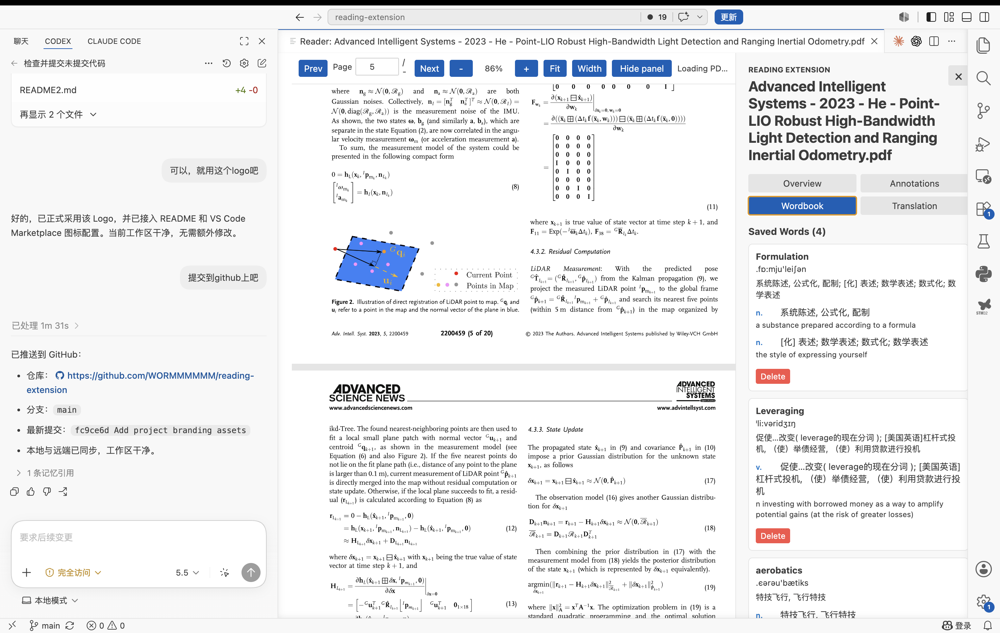

<div align="center">
  
  <h1>Reading Extension</h1>
  <p><strong>A local-first PDF reader for VS Code</strong></p>
  <p>Annotate, translate, build a vocabulary list, and keep your reading data right next to your PDFs.</p>
</div>



## Why I Built This

I wanted to read papers without moving between a separate reading application and my coding tools. I already use assistants such as Codex and Claude Code in VS Code, so the editor is a natural place to keep the rest of my reading workflow too.

Reading Extension focuses on three practical needs:

1. Annotate papers and books while reading.
2. Save unfamiliar words in a simple vocabulary list.
3. Read beside the AI and development tools already available in VS Code.

The extension does not treat a ChatGPT Plus subscription as API access. Optional DeepSeek translation uses a separately configured DeepSeek API key. Local translation is also available through Argos Translate.

## Features

### PDF reading

- Open a PDF from the Command Palette or use the currently active PDF.
- Continuous scrolling with synchronized page progress.
- Trackpad scrolling and pinch-to-zoom.
- Fit-page and fit-width controls.
- Collapsible reader sidebar for a distraction-free view.
- Bundled PDF.js CMaps and standard fonts for improved multilingual PDF compatibility.

### Text selection

- Select real PDF text for translation, copying, highlighting, and notes.
- Copy captured text with `Cmd+C` or `Ctrl+C`.
- Cross-page selections automatically exclude common headers, footers, page numbers, side notices, and inferred figure blocks when the selection starts in body text.
- Start a selection inside a header, footer, or figure when you intentionally want to include it.

### Annotations

- Create colored highlights and underlines.
- Attach notes and tags to selected text.
- Edit, delete, search, filter, sort, and jump to saved annotations.
- Undo the most recent annotation deletion.
- Export annotations as Markdown.
- Export a highlighted PDF with native note comments.
- Autosave changes without a manual save button.

### Translation and dictionary

- Use one `Translate` action for words, sentences, and paragraphs.
- Look up single English words offline with the bundled ECDICT dictionary.
- Show phonetics, parts of speech, Chinese meanings, English definitions, and word forms when available.
- Translate longer text locally with Argos Translate.
- Optionally translate academic text through DeepSeek.
- Use a configurable LibreTranslate server as an alternative or fallback.

### Wordbook

- Save dictionary results to a per-PDF wordbook.
- View phonetics and structured definitions.
- Delete entries you no longer need.

### Portable local data

For a PDF named `paper.pdf`, the extension stores its data next to the PDF:

```text
.reading-extension/
  paper.pdf.annotations.json
  paper.pdf.annotations.md
  paper.pdf.annotated.pdf
  paper.pdf.wordbook.json
  paper.pdf.progress.json
```

These are ordinary local files. They can be synchronized with Git, iCloud Drive, Dropbox, Syncthing, or another file-sync tool.

The extension computes a lightweight content fingerprint so it can recover missing sidecar files after a previously opened PDF is moved or renamed. Existing files at the new location are never overwritten.

## Installation

### VS Code Marketplace

After the public release, search for **Reading Extension** in the VS Code Extensions view and select **Install**.

### Install from a VSIX

Download the latest `.vsix`, then run:

```bash
code --install-extension reading-extension-0.0.1.vsix
```

You can also use **Extensions: Install from VSIX...** from the Command Palette.

## Bundled Runtime Assets

If you install Reading Extension from the Marketplace or from the provided
VSIX, the offline dictionary and PDF font resources are already included. You
do not need to download or configure them manually.

### Offline ECDICT dictionary

The extension package contains:

```text
scripts/ecdict_compact.json.gz
```

This compressed dictionary currently contains about 770,000 English entries.
It is loaded locally when you translate a single English word. Dictionary
lookups do not require Python, a network connection, or an API key.

### PDF.js CMaps and standard fonts

PDFs may use character maps or refer to standard fonts without embedding every
required resource. Reading Extension therefore bundles:

```text
media/pdfjs-dist/cmaps/
media/pdfjs-dist/standard_fonts/
```

The current package contains the complete PDF.js set of 169 Adobe CMaps and 16
standard-font resource files. They are used automatically when a PDF needs
them. Fonts embedded inside a PDF still come from the PDF itself.

### What is not bundled

The Argos Translate Python runtime and neural translation model are not
included in the VSIX because Python environments and native dependencies are
platform-specific. Install them separately only if you want local sentence or
paragraph translation. Offline ECDICT word lookup and the bundled PDF
resources work without Argos.

## Quick Start

1. Open the Command Palette.
2. Run **Reading Extension: Open Paper Reader**.
3. Select an existing PDF or open the command while a PDF is active.
4. Select text to open the floating annotation and translation toolbar.
5. Use the sidebar to view annotations, saved words, translation settings, and document status.

## Translation Setup

### Offline dictionary

The compressed ECDICT dictionary is included in the extension. Single English words can be looked up without network access or additional setup.

### Local Argos Translate

The VSIX does not include a Python virtual environment because virtual environments are platform- and machine-specific.

On macOS or Linux, create a virtual environment and install Argos Translate:

```bash
python3 -m venv ~/.reading-extension-argos
source ~/.reading-extension-argos/bin/activate
python -m pip install --upgrade pip
python -m pip install argostranslate
```

On Windows PowerShell:

```powershell
py -m venv $HOME\.reading-extension-argos
& $HOME\.reading-extension-argos\Scripts\Activate.ps1
python -m pip install --upgrade pip
python -m pip install argostranslate
```

Install the English-to-Chinese model using the
[official Argos package API](https://github.com/argosopentech/argos-translate):

```bash
python - <<'PY'
import argostranslate.package

argostranslate.package.update_package_index()
packages = argostranslate.package.get_available_packages()
package = next(
    item for item in packages
    if item.from_code == "en" and item.to_code == "zh"
)
argostranslate.package.install_from_path(package.download())
print("Installed Argos en -> zh package")
PY
```

On Windows PowerShell, run the same installation code with:

```powershell
@'
import argostranslate.package

argostranslate.package.update_package_index()
packages = argostranslate.package.get_available_packages()
package = next(
    item for item in packages
    if item.from_code == "en" and item.to_code == "zh"
)
argostranslate.package.install_from_path(package.download())
print("Installed Argos en -> zh package")
'@ | python
```

Then configure the virtual environment's Python executable:

```json
{
  "readingExtension.translationProvider": "argos",
  "readingExtension.argosPythonPath": "/Users/you/.reading-extension-argos/bin/python"
}
```

On Windows, the executable normally ends with:

```text
.reading-extension-argos\Scripts\python.exe
```

Restart the reader after changing the setting. The first translation starts
the local daemon and loads the model; later translations reuse that process.

### DeepSeek

1. Generate a DeepSeek API key.
2. Run **Reading Extension: Set DeepSeek API Key**, or select DeepSeek in the Translation sidebar.
3. Enter the key in the secure password prompt.

The key is stored with VS Code SecretStorage. It is not written to settings, sidecar files, logs, or the Webview.

Use **Reading Extension: Clear DeepSeek API Key** to remove it.

### LibreTranslate

Configure a LibreTranslate-compatible endpoint:

```json
{
  "readingExtension.translationProvider": "libretranslate",
  "readingExtension.libreTranslateEndpoint": "http://localhost:5000/translate"
}
```

## Settings

| Setting | Purpose |
| --- | --- |
| `readingExtension.translationProvider` | Select `argos`, `libretranslate`, or `deepseek`. |
| `readingExtension.argosPythonPath` | Python executable containing Argos Translate and language packages. |
| `readingExtension.libreTranslateEndpoint` | LibreTranslate-compatible HTTP endpoint. |
| `readingExtension.translationFallbackToLibreTranslate` | Fall back to LibreTranslate if local Argos translation fails. |
| `readingExtension.translationSource` | Translation source language code; the default is `auto`. |
| `readingExtension.translationTarget` | Translation target language code; the default is `zh`. |
| `readingExtension.deepSeekModel` | DeepSeek model requested by the configured API account. |

## Data and Privacy

- PDFs are read from paths selected by the user.
- Annotations, words, exports, and reading progress remain in `.reading-extension/` beside each PDF.
- A PDF fingerprint-to-path index is stored in VS Code global state for move/rename recovery. It contains paths and timestamps, not annotation or wordbook content.
- API keys are stored in VS Code SecretStorage.
- ECDICT word lookup is offline.
- Local Argos translation runs on the user's machine.
- When DeepSeek is selected, the selected text and translation instruction are sent to the DeepSeek API.
- When LibreTranslate is selected or used as a fallback, the selected text is sent to the configured endpoint.
- The extension does not currently collect telemetry or analytics.

Review the privacy terms of any external translation service before using it with sensitive documents.

## Known Limitations

- Scanned PDFs without a text layer cannot be selected unless OCR is performed separately.
- Header, footer, and figure exclusion is heuristic because many PDFs do not provide reliable semantic structure.
- Local Argos translation requires separate Python and language-package installation.
- The current workflow is optimized for English-to-Chinese reading.
- The extension is in an early preview stage; keep important PDFs and sidecar data backed up.

## Commands

| Command | Description |
| --- | --- |
| `Reading Extension: Open Paper Reader` | Open the current PDF or select one from disk. |
| `Reading Extension: Set DeepSeek API Key` | Store or replace the DeepSeek key securely. |
| `Reading Extension: Clear DeepSeek API Key` | Remove the stored DeepSeek key. |

## Contributing

Issues and pull requests are welcome on
[GitHub](https://github.com/WORMMMMMM/reading-extension).

## Acknowledgements

Reading Extension is built with open-source projects including:

- [PDF.js](https://mozilla.github.io/pdf.js/)
- [react-pdf-highlighter-plus](https://github.com/DanielArnould/react-pdf-highlighter-plus)
- [pdf-lib](https://pdf-lib.js.org/)
- [Argos Translate](https://www.argosopentech.com/)
- [ECDICT](https://github.com/skywind3000/ECDICT)

Third-party components and bundled assets remain subject to their respective licenses.

## License

Reading Extension is released under the [MIT License](LICENSE).
